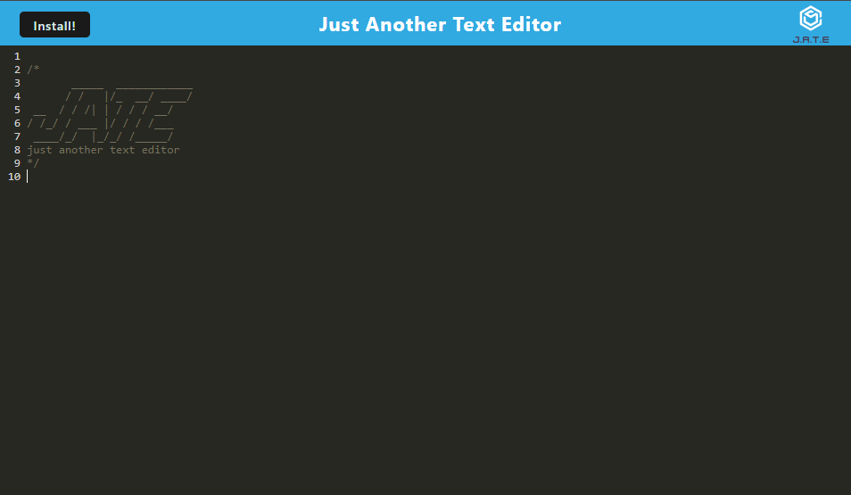

# Progressive Web Application - Text Editor

## Description
This application is a text editor that runs in the browser. The application may also be installed with the button on the upper left corner and the content will persist.

## Table of Contents
- [Deployed](#deployed)
- [Installation](#installation)
- [Usage](#usage)
- [Images](#images)
- [Questions](#questions)

## Deployed
[Heroku](https://progressive-web-app-jate-3648271a1eed.herokuapp.com/) 

## Installation

```
npm i
```

## Usage

In the root directory of the application run:
```
npm run start
```

Then, navigate to [localhost:3000](http://localhost:3000/) in your browser.

## Images


## Questions
If you run into any issues or have questions about this project please reach out to me at claytondguerrero@gmail.com. If you enjoyed this project be sure to check out my other projects on [GitHub](https://github.com/clayguerrero)!
